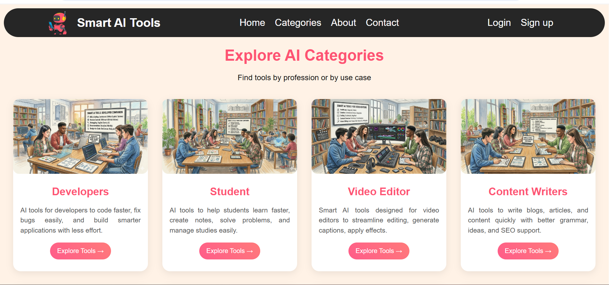

# 🤖 Smart AI Tools

A modern and responsive AI tools discovery website built using HTML and CSS.

Smart AI Tools helps users discover the best AI platforms for developers, students, designers, writers, creators, businesses, and many more.

## 🌟 Features

- ✅ Modern UI Design
- ✅ Responsive Website
- ✅ AI Tools Categories
- ✅ Professional About Page
- ✅ Contact Page
- ✅ Fast Navigation
- ✅ Mobile Friendly
- ✅ Attractive Cards & Sections

## 🛠️ Technologies Used

HTML5
CSS3
Flexbox
CSS Grid
Responsive Design

## 🎯 Project Purpose

The purpose of this project is to create a single platform where users can explore useful AI tools easily.

This website includes categories for:

- Developers
- Students
- Writers
- Designers
- Businesses
- Video Editors
- Content Creators
- Teachers
- Musicians

## 📱 Responsive Design

This website works perfectly on:

- Desktop
- Laptop
- Tablet
- Mobile

## 👨‍💻 Developed By

### Sai Hole

## ▶️ How To Run

1. Download Project
2. Open Folder
3. Run index.html

## 📄 License

This project is made for learning and educational purposes.

# ⭐ Thank You For Visiting Smart AI Tools